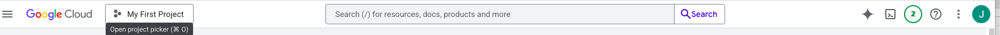
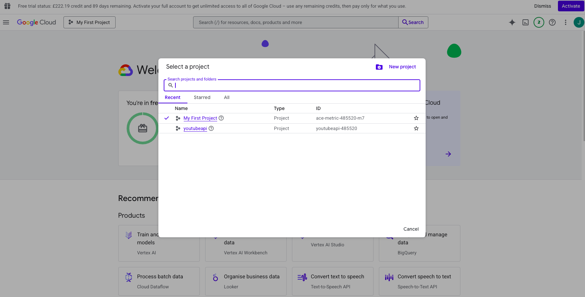
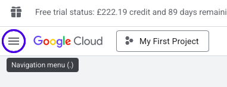
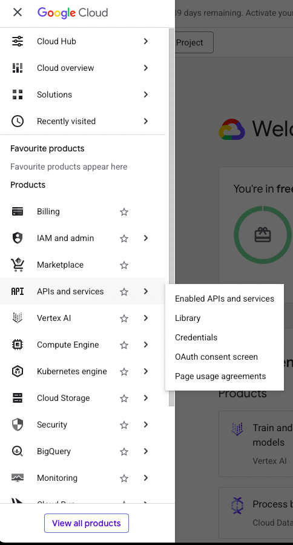
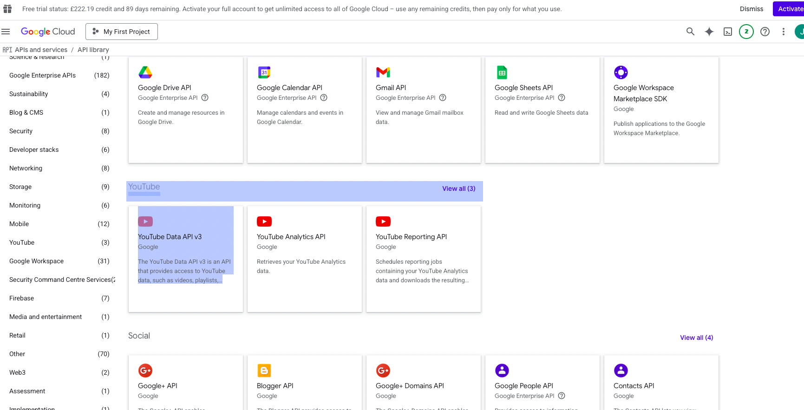
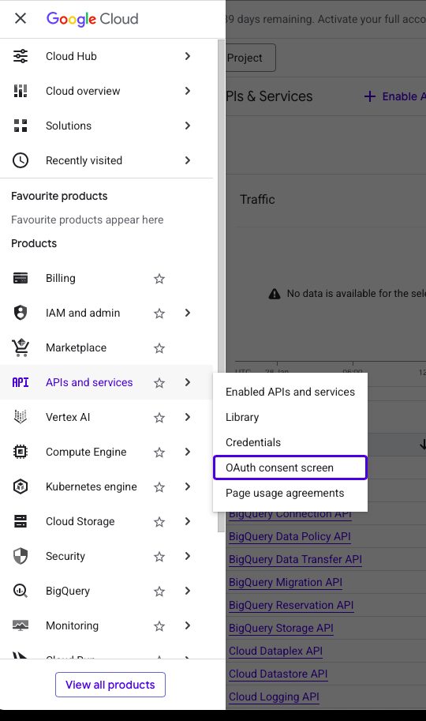
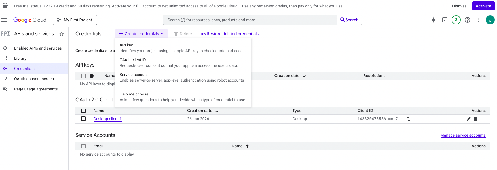
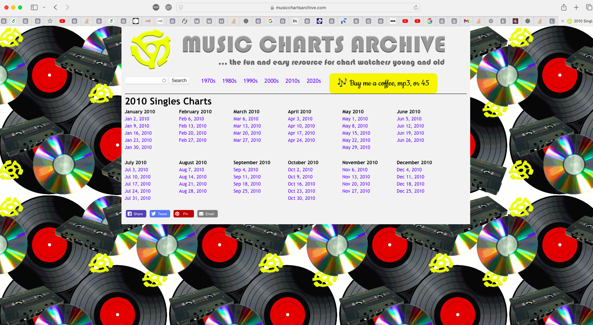

# YouTubePlaylistCreator

## Setup

1. Create a youtube channel by logging into your google account on youtube:

2. Create a Youtube channel by clicking on your profile picture and selecting 'create channel'
3. Go to https://console.cloud.google.com/
4. Sign in with the **Google account that owns your YouTube channel.**
5. Create or select a project by going to: **Project Selector -> New Project**

6. Click **Create**
7. Enable the **YouTube Data API**

    - Left sidebar -> **API & Services** 
    - Click **Library**

    - Search for **YouTube Data API v3**
    - Press **Enable**

8. Configure OAuth consent screen

    - **APIs & Services -> OAuth consent screen**

    - User Type: External (unless you're in a Google Workspace org)
    - click **Create**
9. Fill in the minimum required fields:

    - **App name**: anything (eg _YouTube Playlist Builder_)
    - **User support email**
    - **Developer contact email**

10. Click **Save and Continue** until done
11. Create OAuth credentials(Desktop App)

    - **APIs & Services -> Credentials**
    - Click **+ Create Credentials**
    - Choose **OAuth client ID**

    - Application type: **Desktop app**
    - Name it (anything)
    - Click **Create**
12. Download the file and rename to `client_secret.json`
13. Put this file within your project directory.

## Source

https://musicchartsarchive.com

When inputting the date, be sure to choose from one of the dates above!
Some days will not work (at the moment)